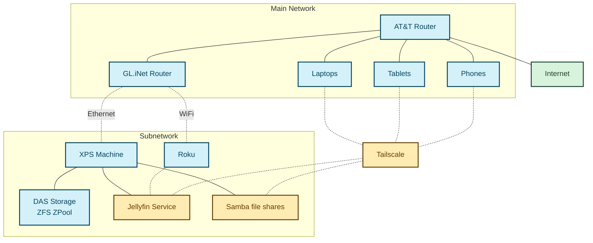

It's difficult balancing the importance of maintaining documentation with the
pain required to write it.  Or at least it was before capable LLMs became so
accessible.

I originally learned about mermaid diagrams a couple of years ago.  I
immediately thought, "What a great idea to capture diagrams with code to allow
version controlling the docs in the same repo as the software itself". Then I
closed the website and never got around to actually writing mermaid code.

GenAI makes this a no brainer now, so I decided to give it another shot: I
spun up an opencode agent session and had it generate a mermaid diagram of some
home network changes I'm tinkering with.

### A simple Mermaid diagram of some machines on my home network

mermaid diagram code:

I wouldn't bother to come up with this on my own, but with an LLM doing the
heavy lifting, it's easy to improve project docs with diagrams as code.
