The fiber drop in our apartment lives in a closet attached to the bathroom.
That might be convenient for AT&T, but it is not where I want to keep a pile of
computer equipment soaking up humidity from hot showers.

Running a loose Ethernet cable across the apartment was not appealing either.
I also did not want to risk damaging the walls or existing wiring to install a
new one.  The apartment does have Ethernet in the walls, but it tops out at 100
Mbps.  That is painful for a 300 Mbps internet connection and even worse when
moving data between machines on the local network.

A Wireless Distribution System (WDS) gave me another option.  WDS creates a
wireless bridge between compatible routers while keeping the devices behind
both routers on the same local network.

That is a little different from how I would normally use a Wi-Fi extender.
GL.iNet's Extender mode receives and retransmits the wireless signal to expand
coverage, potentially cutting the available bandwidth in half.  I am not
trying to improve Wi-Fi coverage on the other side of the apartment.  I want
the Ethernet ports on a second router to behave as if I had managed to run a
cable back to the primary router.

So, naturally, I bought two routers to avoid running one cable.

### The Network I Ended Up With

I bought two [GL.iNet Flint 2
routers](https://www.gl-inet.com/en-us/products/gl-mt6000) specifically for
their WDS functionality.  The AT&T gateway passes the connection through to
the first Flint 2, which acts as the primary router.  The second Flint 2 uses
WDS to bridge the homelab back to the primary router.

<figure>
  
  <figcaption>My home network topology. <a href="./home-network.mmd">View the Mermaid diagram source</a>.</figcaption>
</figure>

### What Lives Behind the Bridge

The internet connection is only part of the story.  ZFS replication, VM
images, CI jobs, and moving data in and out of the storage server can make a
100 Mbps connection feel very small, very quickly.

| Machine | Roles |
| --- | --- |
| homeserver | Application hosting, mail, and ZFS storage |
| xps17 | Development VMs and Forgejo CI runners |
| py-syncoid-target | ZFS snapshot replication |
| fwai0 | Private LLM inference and NixOS builder |

### Was It Actually Fast?

Yes.

I ran OpenSpeedTest on `homeserver` behind the `wifi2` bridge and connected to
it from a laptop on `wifi1`.  The test reached 844.9 Mbps down and 519.9 Mbps
up, with 3 ms of latency and 0.2 ms of jitter.

That is way better than I expected.  It is comfortably faster than the
apartment's 100 Mbps Ethernet and more than enough to make full use of our 300
Mbps internet connection.

The fiber drop can stay in the bathroom closet, the homelab can stay somewhere
dry, and I do not have to run Ethernet across the apartment.  Not bad for a bit
of WDS shenanigans.
